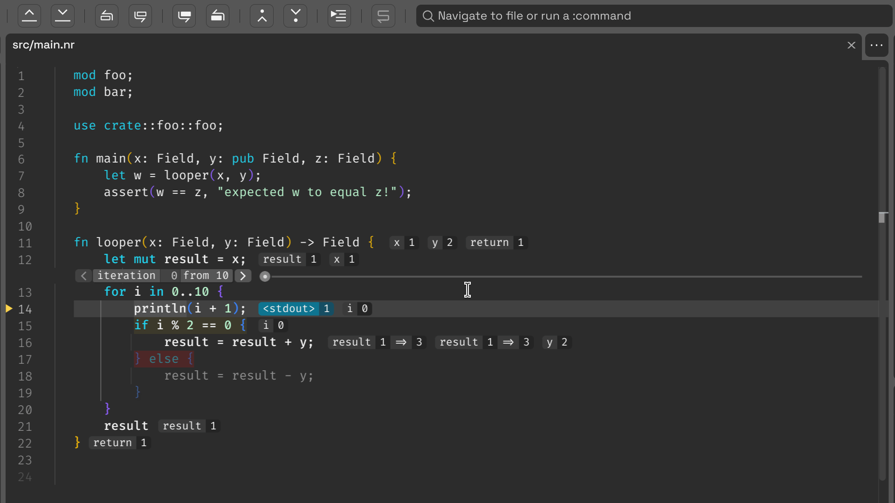

# NTags

<video controls autoplay>
  <source src="video.webm" type="video/webm">
  <source src="video.webp" type="video/webp">
  Your browser does not support the video tag.
</video>

# Limitations

The parser is still very simple. It can handle only top-level
declarations.

In particular, it does not handle:

* Declarations inside procedures.
* Enum members.
* Object fields.

It also does not handle inconsistent use of case/style. A future version
should scan the files for all possible uses of an identifier and
generate tags for all versions.

### TAGS Format

https://ctags.sourceforge.net/FORMAT
